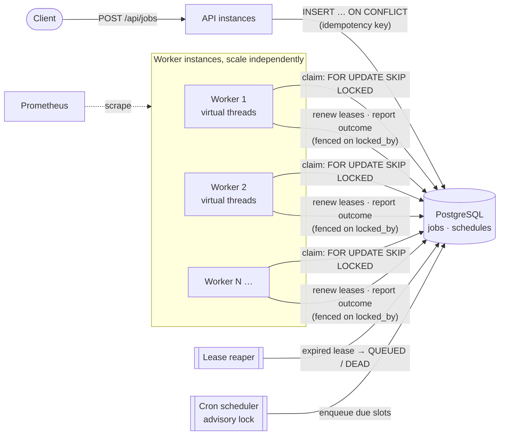
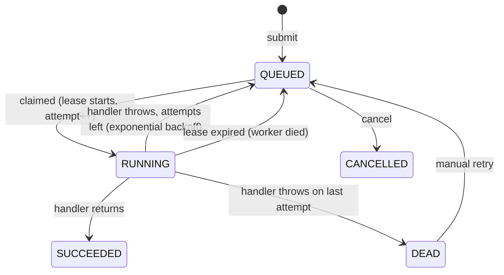

# Distributed Job Queue

[](https://github.com/ebrahimmorkas/distributed-job-queue/actions/workflows/ci.yml)
-orange)


A **reliable background job queue built on PostgreSQL**, with Java 21 virtual threads and Spring Boot 3. Any
number of worker instances pull from the same table. **No job is lost when a worker crashes**, and **no job is
run twice by competing workers**. Failures are retried with exponential backoff, and recurring jobs fire exactly
once per slot across the cluster.

It's the kind of component behind "send the welcome email", "generate the monthly invoice" or "retry the
webhook": the same pattern as Sidekiq, Oban or Solid Queue, built from first principles and verified under
concurrency and crashes.

## Verified results

| Scenario | Result |
|---|---|
| 3 worker containers, 600-job burst (`scripts/load-demo.sh`) | 600/600 succeeded, spread **252 / 183 / 165** across workers, **0 executed twice** |
| 3 competing workers × 300 jobs (integration test) | every job executed **exactly once** |
| Worker "crashes" while holding a job | lease expires, the job is **recovered and completed by another worker** |
| 5-second job with a 3-second lease while the reaper runs every 250 ms | lease is renewed and the job is **never stolen** |
| 8 scheduler ticks at once (simulating 8 instances) | cron slot enqueued **exactly once** |
| Kubernetes manifests (`kubeconform -strict`) | **10/10 resources valid** |

## How it works



### Job lifecycle



## The key ideas

### 1. Claiming with `FOR UPDATE SKIP LOCKED`
```sql
UPDATE jobs SET status='RUNNING', locked_by=:worker, locked_until=now()+:lease, attempts=attempts+1
WHERE id IN (SELECT id FROM jobs
             WHERE status='QUEUED' AND run_at <= now()
             ORDER BY priority DESC, run_at, id
             LIMIT :freeSlots
             FOR UPDATE SKIP LOCKED)
RETURNING *
```
Rows that another worker is claiming are **skipped rather than waited on**, so workers never block each other
and a row can never be claimed twice. The claim, the lease and the attempt count happen in **one statement**.
A **partial index** (`WHERE status = 'QUEUED'`) keeps this query fast however many finished jobs pile up.

### 2. Leases, renewal and crash recovery
- A claim is a **lease** (`locked_until`). Live workers renew their leases every `lease/3`, so long jobs are fine.
- If a worker dies, its leases stop being renewed. The **reaper** (on every instance) sends expired jobs back to
  `QUEUED`, or `DEAD` if that was the last attempt. Concurrent reapers are safe.
- Every outcome update is **fenced**: `… WHERE id = :id AND locked_by = :me`. A slow worker whose lease was
  taken over can't overwrite the new owner's result.
- The result is **at-least-once** execution, so handlers should be idempotent (documented on `JobHandler`).

### 3. Retries that don't stampede
Exponential backoff (`base · 2^(n-1)`, capped) with **jitter**. Jobs that failed together, for example during a
downstream outage, retry spread out rather than all at once.

### 4. Virtual threads
Each job runs on its own virtual thread, which suits I/O-heavy work like HTTP calls, email and databases. A
semaphore caps concurrency, so a worker only claims what it can run right now and leaves the rest for other
instances.

### 5. Cron schedules, exactly once cluster-wide
Two independent guards:
1. `pg_try_advisory_xact_lock` elects one instance per tick. The lock is released automatically at
   commit/rollback, even if the holder crashes.
2. Each enqueued job has idempotency key `schedule:<name>:<slot>`, so even a double tick can't create a
   duplicate.

**Misfire policy:** after downtime, a schedule fires once and then resumes its normal cadence, rather than
flooding the queue with missed slots.

### 6. One clock
Workers compare `run_at <= now()` **on PostgreSQL**, so immediate jobs, retry delays and cron slots are all
computed on the database clock. During development the Docker VM's clock drifted by over an hour. With
app-side timestamps, jobs would have sat invisible for that whole time.

## API

| Method | Endpoint | Description |
|---|---|---|
| `POST` | `/api/jobs` | Enqueue `{type, payload, priority?, maxAttempts?, runAt?, idempotencyKey?}` → **202** |
| `GET` | `/api/jobs/{id}` | Job state, attempts, last error, completed by |
| `GET` | `/api/jobs?status=&type=` | List jobs |
| `POST` | `/api/jobs/{id}/cancel` | Cancel a job that hasn't started |
| `POST` | `/api/jobs/{id}/retry` | Re-queue a DEAD job |
| `GET` | `/api/queue/stats` | Count per status |
| `POST` `GET` | `/api/schedules` | Create / list cron schedules |
| `POST` | `/api/schedules/{name}/pause` · `/resume` | Pause / resume |
| `GET` | `/actuator/prometheus` | Metrics |

Adding a job type means adding a Spring bean:

```java
@Component
class WelcomeEmailHandler implements JobHandler {
    public String type() { return "email.welcome"; }
    public void handle(JobContext ctx) throws Exception {
        mailer.sendWelcome(ctx.payload().get("userId").asText());   // must be idempotent
    }
}
```

## Metrics

| Metric | Use |
|---|---|
| `jobs_queue_lag_seconds` | Age of the oldest due job. **Alert on this**: it's the clearest sign workers are falling behind |
| `jobs_queue_depth{status}` | Backlog and dead-letter growth |
| `jobs_execution_seconds{type,outcome}` | Latency histograms per job type |
| `jobs_completed_total{type,outcome}` | Success / retry / dead rates |
| `jobs_worker_busy{worker}` | Saturation, a signal to scale out |

The queue gauges refresh on a timer, so a Prometheus scrape never queries the database.

## Run it

### Docker Compose (API + 3 workers)
```bash
docker compose up -d --build --scale worker=3
./scripts/load-demo.sh 600      # submit a burst and see how the workers shared it
```
Swagger UI: http://localhost:8080/swagger-ui.html

### Kubernetes
```bash
docker build -t distributed-job-queue .
kind load docker-image distributed-job-queue   # or minikube image load
kubectl apply -k k8s/
```
- The API and the workers are **separate Deployments**, so they scale independently. Workers have an **HPA**
  and a **PodDisruptionBudget**.
- **Shutdown budget:** worker drain (30s) < Spring lifecycle timeout (35s) < preStop + grace period (45s).
  Anything still running after that is picked up by the lease reaper.
- Pods run non-root with read-only root filesystems.

### Tests
```bash
./mvnw verify   # 65 tests on Testcontainers PostgreSQL
```

## Tech stack

Java 21 (virtual threads) · Spring Boot 3.5 · Spring JDBC (`JdbcClient`) · PostgreSQL 16 (`SKIP LOCKED`, advisory
locks, JSONB, partial indexes) · Flyway · Micrometer + Prometheus · Docker · Kubernetes (Kustomize, HPA, PDB) ·
Testcontainers · Awaitility · JUnit 5 · GitHub Actions

## Trade-offs

- **PostgreSQL rather than Kafka or RabbitMQ.** Jobs are enqueued in the same transaction as business data (no
  dual writes), querying and admin are just SQL, and there's one less system to run. This is comfortable up to
  thousands of jobs per second. Beyond that, a dedicated broker makes sense.
- **Polling.** Workers poll every 500 ms when idle. `LISTEN/NOTIFY` could wake them instantly and is a natural
  next step.
- **At-least-once.** Exactly-once is impossible without the handler's cooperation, so handlers must be idempotent.

## Roadmap

- [ ] `LISTEN/NOTIFY` wake-ups to cut idle latency
- [ ] Autoscaling on `jobs_queue_lag_seconds` via KEDA
- [ ] Per-type concurrency limits and rate limits
- [ ] Archive or partition finished jobs

## License

[MIT](LICENSE)
